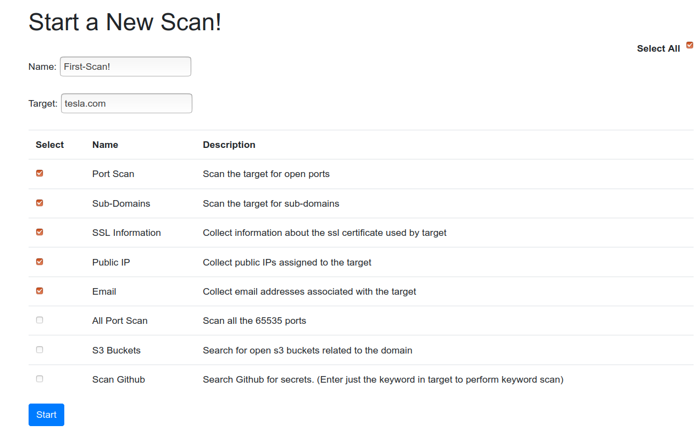

# Project-OSINT

A simple flask web app made to perform OpenSource Intelligence. 

## Usage

```
git clone https://github.com/vandanrohatgi/Project-OSINT.git
cd Project-OSINT
pip3 install -r requirements.txt
python3 db.py
python3 app.py
```

- Clone the repo.
- Install python requirements.
- Run the "db.py" script to create a new sqlite3 database and an empty json file for storing API keys and login creds.
- Finally run the "app.py" file and open the URL in the terminal

- Open the link in browser and login using default creds "test:test" (you can change them in the keys.json file)

- Start a new scan by giving the name and target(in form of domain).
- Check the modules to run and click on start.


- When the screen says "Scan Complete", click on the history tab on the left to check results.


## Create own your modules
- To create your own module use the contents of the "moduletemplate.txt" file.
- Place your module in the modules directory and add the name of your module in the list given in newscan.py

Why did I make this?
I wanted to learn about OSINT, recon and web apps.

## Modules till now
- Port Scan and All port scan: As the name suggests, used for web server port scanning
- S3 bucket scan: A wrapper around the Slurp tools which brute-forces with a nice and big list of permutations
- Email scan: Uses snov.io API to collect emails related to a domain (account creation required)
- Github scan: Searches github for any exposed sensitive information using github API (account creation required) and dorks
- Public IP scan: Uses censys.io API to collect all public IPs assigned to a domain
- SSL Scan: Fetches the ssl certificate from the web server and extracts useful information from it
- Subdomain Scan: A wrapper around famous tools such as amass,sublit3r,assetfinder and subfinder. Runs all the installed tools and produces one final list

Project is tested only on Linux. (ubuntu 18.04 LTS)

***Warning!!!*** This project was made for only for educational purposes. Any harm done by using this tool will not be my responsibility.

`Project Under construction`
